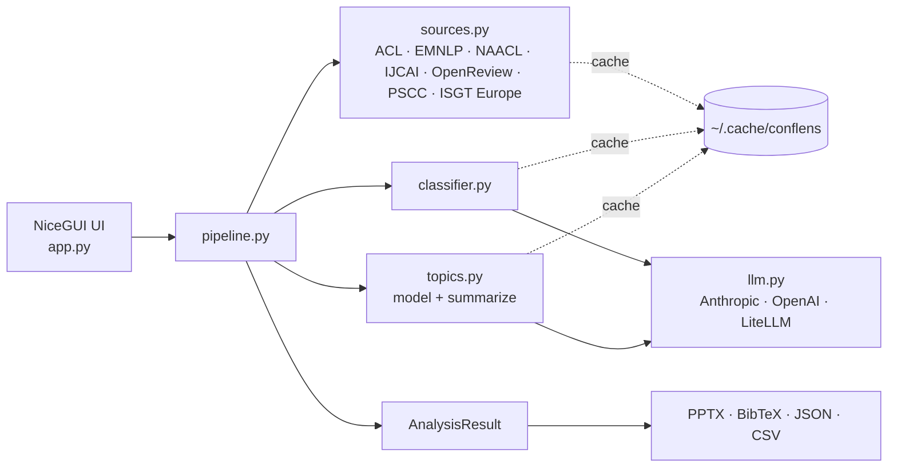

# ConfLens: a Conference Paper Analyzer

[](https://github.com/picaultj/conflens/actions/workflows/lint.yml)
[](https://github.com/picaultj/conflens/actions/workflows/test.yml)
[](https://github.com/picaultj/conflens/releases)
[](https://github.com/picaultj/conflens/releases)
[](https://github.com/picaultj/conflens/stargazers)
[](https://github.com/picaultj/conflens/commits/main)
[](https://github.com/picaultj/conflens/issues)
[](LICENSE)
[](https://www.python.org/)
[](https://docs.astral.sh/uv/)
[](https://nicegui.io)

A desktop-style web app — with **two interchangeable front-ends**,
[NiceGUI](https://nicegui.io) (local/Docker) and [Gradio](https://gradio.app)
(deployed to Hugging Face Spaces) — that:

1. **Browses** papers from a chosen **source** and retrieves their abstracts:
   - the [ACL Anthology](https://aclanthology.org) (default; e.g. `acl-2026`),
   - **EMNLP** and **NAACL** proceedings (also on the ACL Anthology; e.g.
     `emnlp-2024`, `naacl-2024`),
   - **IJCAI** accepted-paper pages (e.g. <https://2026.ijcai.org/accepted-papers/>),
   - **OpenReview** venues — **ICLR / NeurIPS** and more — via the public JSON API,
     by venue id (e.g. `ICLR.cc/2024/Conference`, `NeurIPS.cc/2024/Conference`), and
   - **PSCC** (Power Systems Computation Conference) proceedings, by year
     (e.g. `2024`) — titles + PDFs (abstracts aren't published, so classification
     is title-based), and
   - **ISGT Europe** (IEEE PES) via the open **DBLP** index, by venue + year
     (e.g. `isgteurope 2024`) — titles + DOI links, title-based (the generic
     DBLP adapter works for any DBLP-indexed conference).

   The scraper is pluggable — adding another conference is one adapter in
   `conference_analyzer/sources.py`.
2. **Classifies** each paper with an LLM against a customizable
   **theme** (default *Agentic AI*), keeping only those whose core contribution
   matches.
3. **Discovers topics** within the selected papers (LLM-based by default, with an
   optional BERTopic backend) and shows, for each topic, how many papers it
   contains and a direct **PDF link** to the full text of every paper.


## Contents

- [Quick start](#quick-start) · [Run with Docker](#run-with-docker) · [Deploy to Hugging Face Spaces](#deploy-to-hugging-face-spaces) · [LLM providers](#llm-providers)
- [Architecture](#architecture) · [How it works](#how-it-works)
- [Configuration](#configuration-in-the-ui) · [Features](#features)
- [Caching](#caching) · [Cost](#cost) · [BERTopic](#optional-bertopic)
- [Development](#development)

## Quick start

Requires Python 3.13+ and [uv](https://docs.astral.sh/uv/).

```bash
uv sync                                   # Claude, OpenAI, LiteLLM work out of the box
cp .env.example .env                       # then fill in your provider key(s)
uv run conference-analyzer                # NiceGUI GUI → http://localhost:6868
```

Prefer **Gradio** (same features; the front-end deployed to Hugging Face)?

```bash
uv sync --extra gradio
uv run conflens-gradio                     # Gradio GUI → http://localhost:7860
```

Keys are read from `.env` (loaded automatically) or the process environment;
you can also paste a key into the app's **API key** field at runtime.

`uv` provisions the right Python automatically (pinned to 3.13 via
`.python-version`); you don't need to install it yourself.

### Run with Docker

```bash
cp .env.example .env          # fill in your provider key(s)
docker compose up --build     # → http://localhost:6868
```

The image is built with `uv` on Python 3.13 and includes all LLM
providers. A named volume persists the cache (scrapes + classifications) across
restarts. To clear the cache in a container:

```bash
docker compose run --rm app --clear-cache
```

Plain Docker (no compose) works too:

```bash
docker build -t conference-analyzer .
docker run --rm -p 6868:6868 --env-file .env \
  -v conf-cache:/home/app/.cache/conflens conference-analyzer
```

To also build the optional BERTopic backend into the image:
`docker build --build-arg EXTRAS="--extra bertopic" -t conference-analyzer .`

### Deploy to Hugging Face Spaces

The **Gradio** front-end is deployed to Hugging Face as a **Gradio SDK Space**
(free CPU tier). HF installs [`requirements.txt`](requirements.txt) and runs
[`space_app.py`](space_app.py), which serves `conflens.gradio_app`. A GitHub
Action mirrors `main` to the Space on every push, so it stays in sync.

**One-time setup:**

1. **Create the Space** — on <https://huggingface.co/new-space>, pick **Gradio →
   Blank**, **CPU basic** hardware (this app is CPU-only; ZeroGPU errors with
   *"No @spaces.GPU function detected"*), and note its owner + name (e.g.
   `your-user/conflens`).
2. **Give GitHub a token** — create a Hugging Face access token with **write**
   scope (Settings → Access Tokens) and add it to this GitHub repo as a secret
   named **`HF_TOKEN`** (Settings → Secrets and variables → Actions).
3. **Point the action at your Space** *(optional)* — the workflow defaults to
   owner `picault` and space `conflens` (the HF username differs from the GitHub
   owner). If your Space differs, set repo **variables** `HF_USERNAME` and
   `HF_SPACE`.
4. **Add your API keys as *Space* secrets** — in the Space's *Settings →
   Variables and secrets*, add whatever your provider needs (e.g.
   `ANTHROPIC_API_KEY`, or `OPENAI_API_KEY` / `OPENAI_BASE_URL`; see
   [`.env.example`](.env.example)). The app reads them as environment variables.

That's it — push to `main` (or run the **Sync to Hugging Face Space** workflow
manually) and the Space rebuilds. The Space metadata (`sdk: gradio`,
`app_file: space_app.py`, …) lives in
[`.github/huggingface/space_readme_header.md`](.github/huggingface/space_readme_header.md);
the action prepends it to the README it pushes, so the GitHub README stays clean.

> The Space's filesystem is ephemeral, so the on-disk cache resets on rebuild.
> For persistent caching, attach Hugging Face **persistent storage** and set
> `HOME` (or a `--cache-dir`) to point at its `/data` mount.

> The Docker image above still runs the **NiceGUI** app (`0.0.0.0:6868`) for
> local/self-hosted use; the two front-ends share all analysis logic.

### LLM providers

The classifier and topic engine work with three providers, chosen in the UI:

| Provider | API key (env var or the in-app field) | Notes |
|----------|----------------------------------------|-------|
| **Anthropic** (default) | `ANTHROPIC_API_KEY` | Claude models, native structured output |
| **OpenAI** | `OPENAI_API_KEY` | OpenAI or any OpenAI-compatible base URL |
| **LiteLLM** | `LITELLM_API_KEY` / `OPENAI_API_KEY` | point **LLM endpoint** at your own LiteLLM URL |

In the app, pick the
**LLM provider**, set the **Model**, and (for LiteLLM / OpenAI-compatible
servers) the **LLM endpoint**. An **API key** field overrides the env var when
set — handy for a self-hosted endpoint.

> **Note on the default event:** ACL 2026 proceedings may not be published yet.
> The app handles this gracefully and tells you so — try a past event such as
> `acl-2024` to see a full run.

## Architecture

A NiceGUI front end drives a linear pipeline — **browse → classify →
topic-model → summarize** — over a pluggable *source* (which conference) and a
pluggable *LLM provider* (which model), with every expensive step cached on disk.



See **[docs/ARCHITECTURE.md](docs/ARCHITECTURE.md)** for component, sequence,
data-model and caching diagrams, plus extension points.

## How it works

| Stage | Module | Notes |
|-------|--------|-------|
| Sources | `conflens/sources.py` | Pluggable adapters (ACL Anthology, EMNLP, NAACL, IJCAI, OpenReview, PSCC, DBLP/ISGT Europe) behind one interface; registry + factory. |
| Scrape listing | `conflens/scraper.py` | ACL Anthology adapter: parses the event page; abstracts + authors fetched per paper and cached. |
| Near-duplicates | `conflens/dedup.py` | Flags near-identical titles (union-find + `difflib`); dependency-free. |
| Classify | `conflens/classifier.py` | Batched, structured-output calls; relevance + confidence + a one-line reason per paper (cached). |
| Topic model | `conflens/topics.py` | `llm` backend derives a taxonomy and assigns papers (primary + optional secondary topic); `bertopic` backend optional. |
| Summarize | `conflens/topics.py` | Per-topic description + common findings across the topic's papers (cached). |
| LLM providers | `conflens/llm.py` | One `structured()` interface over Anthropic / OpenAI / LiteLLM. |
| Orchestrate | `conflens/pipeline.py` | Runs the stages with progress reporting and cooperative cancel. |
| UI / exports | `conflens/app.py`, `pptx_export.py`, `bibtex.py` | NiceGUI; ECharts chart; interactive results view; PPTX / BibTeX / JSON / CSV export. |

## Configuration (in the UI)

- **Source** — `ACL Anthology`, `EMNLP (ACL Anthology)`, `NAACL (ACL Anthology)`,
  `IJCAI`, `OpenReview (ICLR / NeurIPS)`, `PSCC`, or `ISGT Europe (via DBLP)`.
  Switching prefills the base URL and target below and relabels them. (ACL
  Anthology, EMNLP and NAACL share one adapter — any of them accepts any
  Anthology event slug, e.g. `acl-2024`, `emnlp-2023`, `naacl-2024`.)
- **Base URL** — the site/API root (e.g. `https://aclanthology.org`,
  `https://2026.ijcai.org`, `https://api2.openreview.net`); change it to point at
  a mirror, another year, or the v1 API host (`https://api.openreview.net`).
- **Event / target** — for ACL, a slug (`acl-2024`, `emnlp-2023`, …) or full
  event URL; for IJCAI, the accepted-papers path or full URL; for OpenReview, the
  **venue id** (`ICLR.cc/2024/Conference`, `NeurIPS.cc/2024/Conference`) or a
  venue group URL; for PSCC, a **year** (`2024`, `2022`, …) or a full listing URL;
  for ISGT Europe, a DBLP **venue + year** (`isgteurope 2024`) or proceedings key.

  > **Title-based sources** — PSCC and DBLP-backed venues (ISGT Europe) don't
  > expose abstracts, so classification runs on titles alone (still useful, just
  > coarser). The DBLP adapter is generic: any DBLP-indexed conference works by
  > passing `<venue> <year>`. IEEE-Xplore-only venues that DBLP doesn't index
  > (e.g. **PowerTech**, **PES General Meeting**) can't be added without an IEEE
  > Xplore API key.

  > **OpenReview auth** — recent (API v2) venues challenge anonymous requests
  > from some networks. If a run returns an auth error, set `OPENREVIEW_TOKEN`,
  > or `OPENREVIEW_USERNAME` + `OPENREVIEW_PASSWORD` (see `.env.example`); the
  > adapter logs in and authenticates automatically. Older venues work
  > anonymously.
- **Theme** — any phrase; defaults to *Agentic AI*.
- **Theme definition** — optional free text clarifying what the theme includes
  or excludes (e.g. *"tool-using LLM agents; exclude pure RL"*). It is threaded
  into classification, topic discovery, and summaries to sharpen relevance, and
  is part of the classification cache key.
- **LLM provider** — Anthropic (default), OpenAI, or LiteLLM.
- **Model** — free-text; defaults per provider (e.g. `claude-opus-4-8`,
  `gpt-4o-mini`). Suggestions appear as placeholder text.
- **LLM endpoint / API key** — a custom base URL (LiteLLM or any
  OpenAI-compatible server) and an optional key override.
- **Topic engine** — `LLM` (no extra deps) or `BERTopic` (requires the
  optional `bertopic` install).
- **Max papers**, **target topics**, **minimum confidence** — tuning knobs.

## Features

- Per-topic bar chart of paper counts.
- For each topic, an LLM-generated **description** and **5–10 common findings**
  (synthesised across the topic's papers, not paper-specific), shown above the
  paper list.
- **Multi-topic assignment** — a paper can belong to a primary topic and, when it
  genuinely spans two areas, a secondary one; secondary memberships show an
  *"Also in: …"* line, and the CSV export lists every assigned topic.
- **Near-duplicate detection** — papers with near-identical titles (e.g. a
  preprint and its camera-ready) are clustered with a dependency-free fuzzy match
  and flagged with a *near-dup* badge naming the representative; the count of
  groups appears in the summary and a `duplicate_of` column is added to the CSV.
- A **keyword search** that filters the papers by their title or abstract —
  comma-separated keywords (each may contain spaces), matched with AND. Matched
  keywords are **highlighted** in the title and abstract, topics with no match
  are hidden, and a **"Search all topics"** toggle flattens every match into one
  ranked list (a multi-topic paper appears once, tagged with its topics).
- A **live confidence slider** in the results view: because the raw model
  judgement is cached, re-thresholding re-filters the papers, counts, and chart
  instantly — no re-run.
- **Sort** papers by confidence, title, or year, and **filter by author** —
  all applied live on top of the search and confidence filters.
- **Save / load a run** — the JSON export is a complete snapshot; use *"Load
  saved run"* to reopen it later and browse, search, and re-threshold without
  re-analysing.
- Expandable abstracts and a per-paper relevance rationale.
- One-click **PDF** links to every paper's full text.
- A **Cancel** button and elapsed-time readout for long runs; LLM calls
  automatically retry transient errors (rate limits / 5xx / timeouts).
- Export results as a **PPTX** slide deck, **BibTeX**, **JSON**, or **CSV**.
  The deck (built with `python-pptx`) has a title slide, a papers-per-topic
  chart, and per topic an overview slide (description + common findings) plus
  slides listing its papers with clickable PDF links.
- On-disk caching of scraped data so re-runs are fast (see below).

## Caching

Everything expensive is cached on disk under `~/.cache/conflens`:

- the **event listing** is cached per event/page URL,
- each paper's **abstract + authors** is cached per paper id, and
- **classification results** are cached per *(provider + model, theme)* and keyed
  by each paper's title+abstract hash. The raw model judgement is stored, so the
  **minimum-confidence** threshold is applied at read time — adjusting it never
  triggers a re-call.
- **topic summaries** (description + common findings) are cached per
  *(provider + model, theme)* and keyed by the topic's exact paper membership.

So re-running with a **different theme** reuses the cached scrape (only
classification re-runs), and **re-running the same theme + model is essentially
free**. Changing the model or a paper's abstract re-classifies only what's
affected. Tick **“Refresh from source”** in the UI to bypass every cache and
rebuild from scratch.

To wipe the cache from the command line:

```bash
uv run conference-analyzer --clear-cache          # default ~/.cache/conflens
uv run conference-analyzer --clear-cache --cache-dir /path/to/cache
```

Other flags: `--host`, `--port` (run `conference-analyzer --help`).

## Cost

Classification batches ~20 papers per request, so a 150-paper run is a handful
of API calls. Pick a small model (e.g. `claude-haiku-4-5` or `gpt-4o-mini`) to
minimise cost.

## Optional: BERTopic

```bash
uv sync --extra bertopic
```

Then pick **BERTopic** as the topic engine in the UI. It clusters
sentence-embeddings instead of asking the LLM to organise topics.

## Development

```bash
uv sync              # installs the dev group (pytest + ruff) too
uv run pytest        # run the test suite
uv run ruff check .  # lint
uv build             # build the wheel/sdist
```

CI is GitHub Actions, one workflow per concern, each running on **every pushed
commit** and every PR:

- **`lint.yml`** — ruff on every commit.
- **`test.yml`** — pytest + package build.
- **`release.yml`** — version bump + tag on PR merge (see below).

The tests are network- and API-free (parsers run on HTML fixtures; the LLM
stages use a fake client), so they're fast and deterministic.

### Releasing

Releases are automated (`.github/workflows/release.yml`): when a PR is **merged
into `main`**, the workflow bumps the version in `pyproject.toml`, commits it
back to `main`, and creates a matching `vX.Y.Z` **tag**. The bump is a **patch**
by default — add a **`minor`** or **`major`** label to the PR to bump those
instead.

