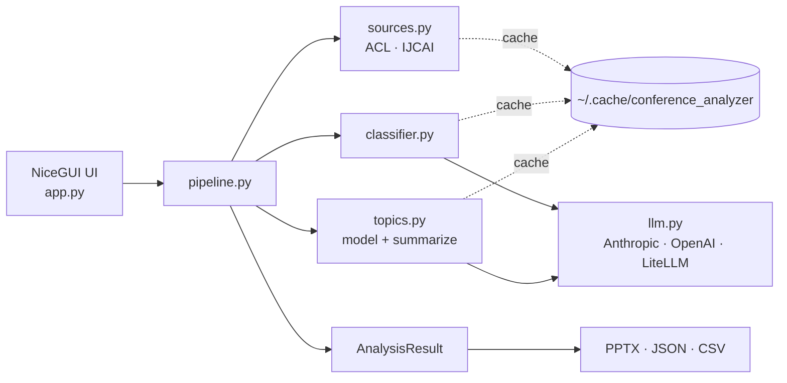

# ConfLens: a Conference Paper Analyzer

[](https://github.com/picaultj/conflens/releases)
[](https://github.com/picaultj/conflens/releases)
[](https://github.com/picaultj/conflens/stargazers)
[](https://github.com/picaultj/conflens/commits/main)
[](https://github.com/picaultj/conflens/issues)
[](LICENSE)
[](https://www.python.org/)
[](https://docs.astral.sh/uv/)
[](https://nicegui.io)

A desktop-style web app (built with [NiceGUI](https://nicegui.io)) that:

1. **Browses** papers from a chosen **source** and retrieves their abstracts:
   - the [ACL Anthology](https://aclanthology.org) (default; e.g. `acl-2026`), and
   - **IJCAI** accepted-paper pages (e.g. <https://2026.ijcai.org/accepted-papers/>).

   The scraper is pluggable — adding another conference is one adapter in
   `conference_analyzer/sources.py`.
2. **Classifies** each paper with an LLM (Claude) against a customizable
   **theme** (default *Agentic AI*), keeping only those whose core contribution
   matches.
3. **Discovers topics** within the selected papers (LLM-based by default, with an
   optional BERTopic backend) and shows, for each topic, how many papers it
   contains and a direct **PDF link** to the full text of every paper.

The interface is deliberately sober and professional: white background, a single
navy accent, clean cards.


## Quick start

Requires Python 3.13+ and [uv](https://docs.astral.sh/uv/).

```bash
uv sync                                   # Claude/Anthropic works out of the box
cp .env.example .env                       # then fill in your provider key(s)
uv run conference-analyzer                # or: uv run python run.py
```

Keys are read from `.env` (loaded automatically) or the process environment;
you can also paste a key into the app's **API key** field at runtime.

Then open <http://localhost:8080>.

`uv` provisions the right Python automatically (pinned to 3.13 via
`.python-version`); you don't need to install it yourself.

### Run with Docker

```bash
cp .env.example .env          # fill in your provider key(s)
docker compose up --build     # → http://localhost:8080
```

The image is built with `uv` on Python 3.13 and includes the OpenAI + LiteLLM
providers. A named volume persists the cache (scrapes + classifications) across
restarts. To clear the cache in a container:

```bash
docker compose run --rm app --clear-cache
```

Plain Docker (no compose) works too:

```bash
docker build -t conference-analyzer .
docker run --rm -p 8080:8080 --env-file .env \
  -v conf-cache:/home/app/.cache/conference_analyzer conference-analyzer
```

To also build the optional BERTopic backend into the image:
`docker build --build-arg EXTRAS="--extra all --extra bertopic" -t conference-analyzer .`

### LLM providers

The classifier and topic engine work with three providers, chosen in the UI:

| Provider | Install | API key (env var or the in-app field) | Notes |
|----------|---------|----------------------------------------|-------|
| **Anthropic** (default) | included | `ANTHROPIC_API_KEY` | Claude models, native structured output |
| **OpenAI** | `uv sync --extra openai` | `OPENAI_API_KEY` | OpenAI or any OpenAI-compatible base URL |
| **LiteLLM** | `uv sync --extra litellm` | `LITELLM_API_KEY` / `OPENAI_API_KEY` | point **LLM endpoint** at your own LiteLLM URL |

Install both extra providers with `uv sync --extra all`. In the app, pick the
**LLM provider**, set the **Model**, and (for LiteLLM / OpenAI-compatible
servers) the **LLM endpoint**. An **API key** field overrides the env var when
set — handy for a self-hosted endpoint.

> **Note on the default event:** ACL 2026 proceedings may not be published yet.
> The app handles this gracefully and tells you so — try a past event such as
> `acl-2024` to see a full run.

## Architecture

A NiceGUI front end drives a linear pipeline — **browse → classify →
topic-model → summarize** — over a pluggable *source* (which conference) and a
pluggable *LLM provider* (which model), with every expensive step cached on disk.



See **[docs/ARCHITECTURE.md](docs/ARCHITECTURE.md)** for component, sequence,
data-model and caching diagrams, plus extension points.

## How it works

| Stage | Module | Notes |
|-------|--------|-------|
| Sources | `conference_analyzer/sources.py` | Pluggable adapters (ACL Anthology, IJCAI) behind one interface; registry + factory. |
| Scrape listing | `conference_analyzer/scraper.py` | ACL Anthology adapter: parses the event page; abstracts + authors fetched per paper and cached. |
| Classify | `conference_analyzer/classifier.py` | Batched, structured-output calls; relevance + confidence + a one-line reason per paper (cached). |
| Topic model | `conference_analyzer/topics.py` | `llm` backend derives a taxonomy and assigns papers; `bertopic` backend optional. |
| Summarize | `conference_analyzer/topics.py` | Per-topic description + 5–10 common findings across the topic's papers (cached). |
| LLM providers | `conference_analyzer/llm.py` | One `structured()` interface over Anthropic / OpenAI / LiteLLM. |
| Orchestrate | `conference_analyzer/pipeline.py` | Runs the stages with progress reporting. |
| UI / exports | `conference_analyzer/app.py`, `pptx_export.py` | NiceGUI; ECharts chart; PPTX / JSON / CSV export. |

## Configuration (in the UI)

- **Source** — `ACL Anthology` or `IJCAI`. Switching prefills the base URL and
  target below and relabels them.
- **Base URL** — the site root (e.g. `https://aclanthology.org`,
  `https://2026.ijcai.org`); change it to point at a mirror or another year.
- **Event / accepted-papers path** — for ACL, a slug (`acl-2024`, `emnlp-2023`,
  …) or full event URL; for IJCAI, the accepted-papers path or full URL.
- **Theme** — any phrase; defaults to *Agentic AI*.
- **LLM provider** — Anthropic (default), OpenAI, or LiteLLM.
- **Model** — free-text; defaults per provider (e.g. `claude-opus-4-8`,
  `gpt-4o-mini`). Suggestions appear as placeholder text.
- **LLM endpoint / API key** — a custom base URL (LiteLLM or any
  OpenAI-compatible server) and an optional key override.
- **Topic engine** — `LLM` (no extra deps) or `BERTopic` (requires the
  optional `bertopic` install).
- **Max papers**, **target topics**, **minimum confidence** — tuning knobs.

## Features

- Per-topic bar chart of paper counts.
- For each topic, an LLM-generated **description** and **5–10 common findings**
  (synthesised across the topic's papers, not paper-specific), shown above the
  paper list.
- A **keyword search** that filters the papers listed under each topic by their
  abstract — comma-separated keywords (each may contain spaces), matched with AND;
  topics with no match are hidden and matching ones auto-expand.
- Expandable abstracts and a per-paper relevance rationale.
- One-click **PDF** links to every paper's full text.
- Export results as a **PPTX** slide deck, **JSON**, or **CSV**.
  The deck (built with `python-pptx`) has a title slide, a papers-per-topic
  chart, and per topic an overview slide (description + common findings) plus
  slides listing its papers with clickable PDF links.
- On-disk caching of scraped data so re-runs are fast (see below).

## Caching

Everything expensive is cached on disk under `~/.cache/conference_analyzer`:

- the **event listing** is cached per event/page URL,
- each paper's **abstract + authors** is cached per paper id, and
- **classification results** are cached per *(provider + model, theme)* and keyed
  by each paper's title+abstract hash. The raw model judgement is stored, so the
  **minimum-confidence** threshold is applied at read time — adjusting it never
  triggers a re-call.
- **topic summaries** (description + common findings) are cached per
  *(provider + model, theme)* and keyed by the topic's exact paper membership.

So re-running with a **different theme** reuses the cached scrape (only
classification re-runs), and **re-running the same theme + model is essentially
free**. Changing the model or a paper's abstract re-classifies only what's
affected. Tick **“Refresh from source”** in the UI to bypass every cache and
rebuild from scratch.

To wipe the cache from the command line:

```bash
uv run conference-analyzer --clear-cache          # default ~/.cache/conference_analyzer
uv run conference-analyzer --clear-cache --cache-dir /path/to/cache
```

Other flags: `--host`, `--port` (run `conference-analyzer --help`).

## Cost

Classification batches ~20 papers per request, so a 150-paper run is a handful
of API calls. Pick a small model (e.g. `claude-haiku-4-5` or `gpt-4o-mini`) to
minimise cost.

## Optional: BERTopic

```bash
uv sync --extra bertopic
```

Then pick **BERTopic** as the topic engine in the UI. It clusters
sentence-embeddings instead of asking the LLM to organise topics.
