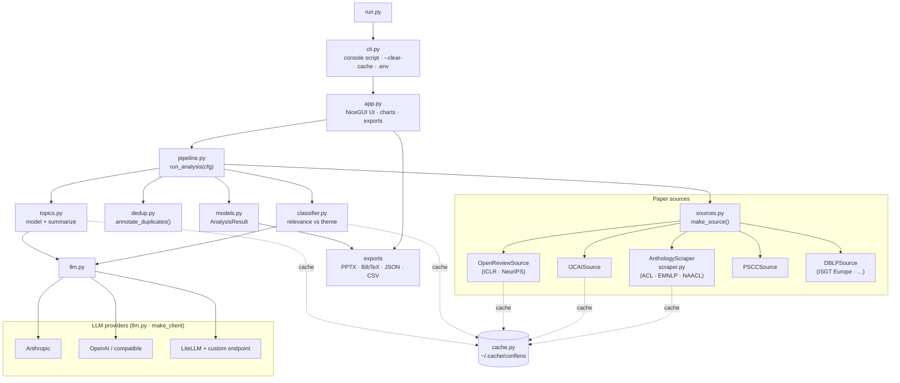
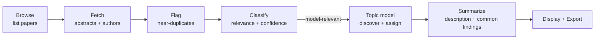
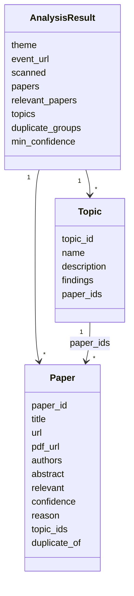

# Architecture

ConfLens is a small, single-process web app. A NiceGUI front end drives a
linear pipeline — **browse → classify → topic-model → summarize** — over a
pluggable *source* (which conference) and a pluggable *LLM provider* (which
model). Everything expensive is cached on disk.

## Components



EMNLP and NAACL are served by the same `AnthologyScraper` as the ACL Anthology
(different default event); OpenReview talks to the public JSON API instead of
scraping HTML; PSCC reads a per-year HTML fragment from its papers-repository
endpoint (titles + PDFs only — no abstracts, so classification is title-based);
`DBLPSource` uses the open DBLP search API to reach IEEE-Xplore-only venues such
as ISGT Europe (titles + DOI links, also title-based, and generic to any
DBLP-indexed conference).

## Pipeline stages



Each stage reports progress back to the UI; the whole run executes in a worker
thread so the interface stays responsive.

Classification keeps **every** paper the model judges relevant and records the
run's `min_confidence` on the result; the confidence cut-off is then applied in
the UI, so the results view can re-threshold (and search, sort, facet) live
without re-running. See *Results view* below.

## A run, end to end

```mermaid
sequenceDiagram
    actor User
    participant UI as UI (app.py)
    participant P as Pipeline
    participant S as Source
    participant C as Classifier
    participant T as Topics
    participant L as LLM provider

    User->>UI: Configure + click Analyze
    UI->>UI: validate (model set, target, endpoint)
    UI->>P: run_analysis(cfg) in a worker thread
    P->>S: list_papers + enrich_abstracts
    Note over S: disk cache per URL / paper id
    S-->>P: papers (title, abstract, authors)
    P->>P: annotate_duplicates (near-dup titles)
    P->>C: classify_papers(theme)
    C->>L: batched structured calls
    Note over C: cache per (provider+model, theme)<br/>keeps all model-relevant; threshold applied in UI
    C-->>P: model-relevant papers
    P->>T: model_topics (discover + assign)
    T->>L: taxonomy + assignment
    P->>T: summarize_topics
    T->>L: per-topic description + common findings
    Note over T: cache per (provider+model, theme, membership)
    T-->>P: topics
    P-->>UI: AnalysisResult
    UI-->>User: topics · findings · papers · PPTX/JSON/CSV
```

## Modules

| Module | Responsibility                                                                                                                                                                                                    |
|--------|-------------------------------------------------------------------------------------------------------------------------------------------------------------------------------------------------------------------|
| `cli.py` | Console entry point (`conflens`); `--clear-cache`, `--host/--port`; loads `.env`.                                                                                                                                 |
| `app.py` | NiceGUI UI: configuration form, input validation, progress, and the interactive results view (ECharts chart, per-topic findings + papers, live re-threshold / search / sort / facet, save + load a run), exports. |
| `pipeline.py` | `AnalysisConfig` + `run_analysis()` orchestrating the stages with a `Progress` object (supports cooperative cancel).                                                                                              |
| `sources.py` | Source interface + registry + `make_source()`; `IJCAISource`, `OpenReviewSource`, `PSCCSource`, `DBLPSource`, shared `_robust_get`.                                                                                |
| `scraper.py` | `AnthologyScraper` (ACL Anthology adapter, also serving EMNLP / NAACL) + shared HTML helpers.                                                                                                                     |
| `dedup.py` | `annotate_duplicates()` — dependency-free near-duplicate-title clustering (union-find + `difflib`).                                                                                                               |
| `classifier.py` | Batched, structured-output relevance classification with on-disk cache.                                                                                                                                           |
| `topics.py` | Topic modelling (LLM / BERTopic, multi-topic assignment) **and** per-topic synthesis (`summarize_topics`).                                                                                                        |
| `llm.py` | Provider abstraction (`LLMClient`) + `make_client()` for Anthropic / OpenAI / LiteLLM; transient-error retry.                                                                                                     |
| `pptx_export.py`, `bibtex.py` | Deterministic PowerPoint deck (`python-pptx`) and BibTeX export.                                                                                                                                                  |
| `cache.py` | Cache location + `clear_cache()`.                                                                                                                                                                                 |
| `models.py` | `Paper`, `Topic`, `AnalysisResult` dataclasses (+ `to_dict`/`from_dict` for save/load).                                                                                                                           |

## Data model



`Paper.topic_ids` holds the primary topic first and an optional secondary one
(a `topic_id` property returns the primary for convenience); `duplicate_of`
points at the representative of a near-duplicate group. `AnalysisResult` carries
`to_dict()`/`from_dict()` so a run round-trips through the JSON export for
save/load.

## Results view (client-side)

Once `run_analysis` returns, everything the results view does is **client-side**
over the in-memory `AnalysisResult` — no further API calls:

- **Live re-threshold** — the confidence slider filters papers, per-topic counts
  and the bar chart against the cached judgement (the run keeps all
  model-relevant papers; the slider defaults to the run's `min_confidence`).
- **Keyword search + highlight** — comma-separated keywords (AND), matched in
  title/abstract and wrapped in `<mark>`; a *Search all topics* toggle flattens
  matches into one ranked list.
- **Sort & facet** — sort by confidence / title / year and filter by author.
- **Save / load** — the JSON export is a full snapshot; *Load saved run* rebuilds
  an `AnalysisResult` via `from_dict` and renders it without re-analysing.

A single `_apply_view()` recomputes the filtered/sorted view and re-renders the
chart and papers; the grouped and flattened layouts share one per-paper renderer.

## Caching

All caches live under `~/.cache/conflens` (override with
`--cache-dir`; wipe with `--clear-cache` or the UI's *Refresh from source*).

| Cache | Key | Invalidated by |
|-------|-----|----------------|
| Listing | source page URL | Refresh from source |
| Abstract + authors | paper id | Refresh from source |
| Classification | (provider+model, theme) + paper title/abstract hash | model/theme change, edited abstract, Refresh |
| Topic summary | (provider+model, theme) + topic paper membership | membership change, model/theme change, Refresh |

Because only the theme- and model-dependent stages are keyed on those, changing
the **theme** reuses the scrape, and re-running the **same theme + model** reuses
everything.

## Extension points

- **Add a conference**: implement `resolve_url` / `list_papers` /
  `enrich_abstracts` in `sources.py` and register it in `SOURCES`. An adapter can
  scrape HTML (like `AnthologyScraper`) or call a JSON API (like
  `OpenReviewSource`) — the pipeline only depends on the three methods. If the
  proceedings already live on the ACL Anthology, just add a registry entry
  pointing at `AnthologyScraper` (as EMNLP and NAACL do).
- **Add an LLM provider**: add an `LLMClient` subclass in `llm.py` and a branch
  in `make_client()`. Classification and summarization work through the same
  `structured()` interface, so nothing downstream changes.
- **Swap topic modelling**: `topics.model_topics()` dispatches on a backend
  string (`llm` / `bertopic`).
