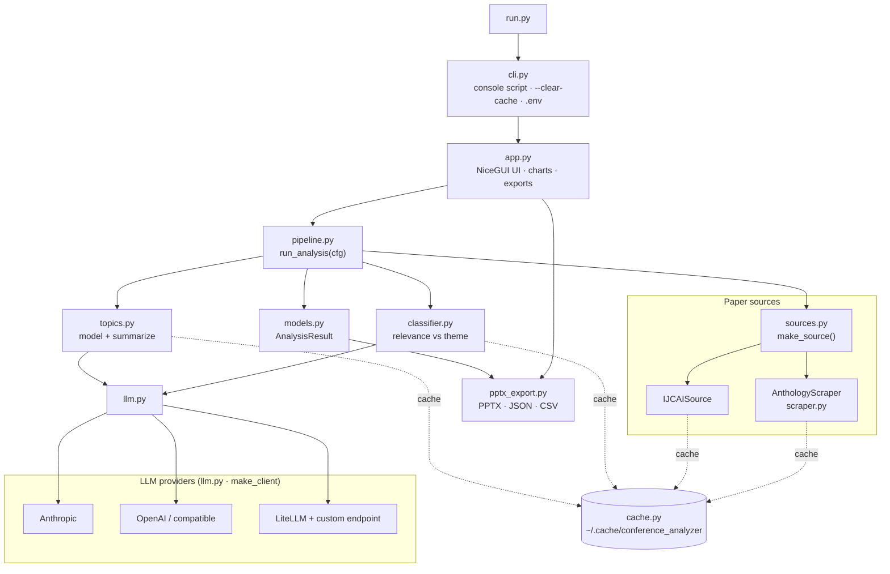
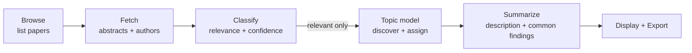
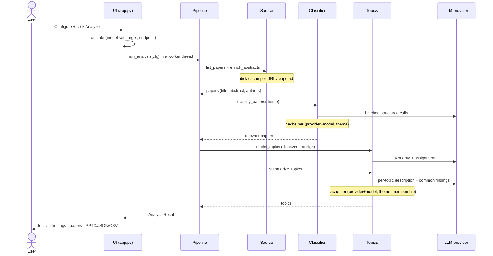
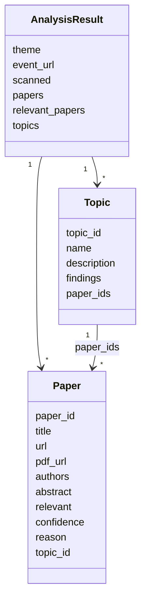

# Architecture

ConfLens is a small, single-process web app. A NiceGUI front end drives a
linear pipeline — **browse → classify → topic-model → summarize** — over a
pluggable *source* (which conference) and a pluggable *LLM provider* (which
model). Everything expensive is cached on disk.

## Components

## Pipeline stages

Each stage reports progress back to the UI; the whole run executes in a worker
thread so the interface stays responsive.

## A run, end to end

## Modules

| Module | Responsibility |
|--------|----------------|
| `cli.py` | Console entry point (`conference-analyzer`); `--clear-cache`, `--host/--port`; loads `.env`. |
| `app.py` | NiceGUI UI: configuration form, input validation, progress, results (ECharts chart, per-topic findings + papers), exports. |
| `pipeline.py` | `AnalysisConfig` + `run_analysis()` orchestrating the stages with a `Progress` object. |
| `sources.py` | Source interface + registry + `make_source()`; `IJCAISource`. |
| `scraper.py` | `AnthologyScraper` (ACL Anthology adapter) + shared HTML helpers. |
| `classifier.py` | Batched, structured-output relevance classification with on-disk cache. |
| `topics.py` | Topic modelling (LLM / BERTopic) **and** per-topic synthesis (`summarize_topics`). |
| `llm.py` | Provider abstraction (`LLMClient`) + `make_client()` for Anthropic / OpenAI / LiteLLM. |
| `pptx_export.py` | Deterministic PowerPoint deck via `python-pptx`. |
| `cache.py` | Cache location + `clear_cache()`. |
| `models.py` | `Paper`, `Topic`, `AnalysisResult` dataclasses. |

## Data model

## Caching

All caches live under `~/.cache/conference_analyzer` (override with
`--cache-dir`; wipe with `--clear-cache` or the UI's *Refresh from source*).

| Cache | Key | Invalidated by |
|-------|-----|----------------|
| Listing | source page URL | Refresh from source |
| Abstract + authors | paper id | Refresh from source |
| Classification | (provider+model, theme) + paper title/abstract hash | model/theme change, edited abstract, Refresh |
| Topic summary | (provider+model, theme) + topic paper membership | membership change, model/theme change, Refresh |

Because only the theme- and model-dependent stages are keyed on those, changing
the **theme** reuses the scrape, and re-running the **same theme + model** reuses
everything.

## Extension points

- **Add a conference**: implement `resolve_url` / `list_papers` /
  `enrich_abstracts` in `sources.py` and register it in `SOURCES`.
- **Add an LLM provider**: add an `LLMClient` subclass in `llm.py` and a branch
  in `make_client()`. Classification and summarization work through the same
  `structured()` interface, so nothing downstream changes.
- **Swap topic modelling**: `topics.model_topics()` dispatches on a backend
  string (`llm` / `bertopic`).
